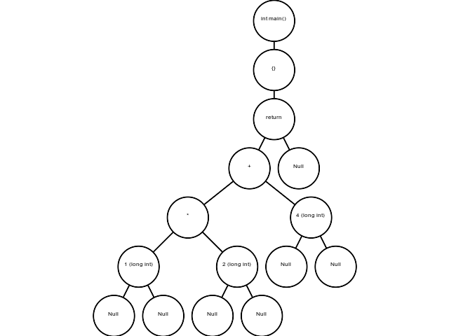
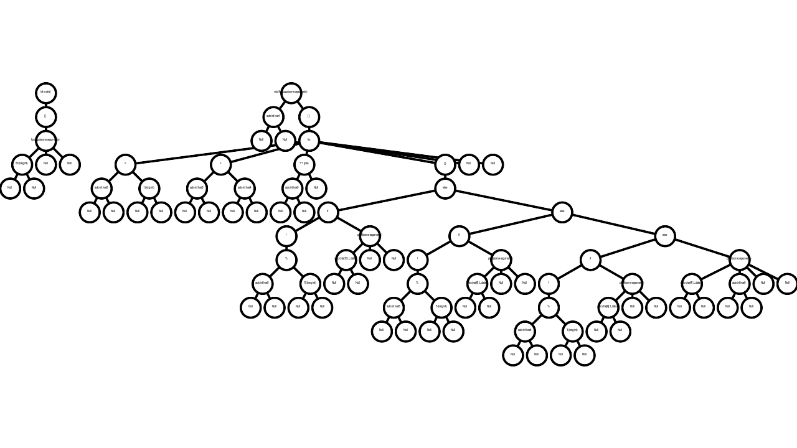
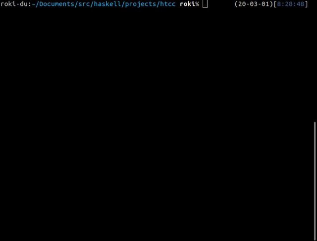

<h1><p align="center">htcc</a></h1>

<p align="center">
:baby_chick: A tiny C language compiler (x86-64) (WIP)
</p>

<div align="center">
<a href="https://travis-ci.org/falgon/htcc">
    
</a>
<a href="https://github.com/falgon/htcc/actions?query=workflow%3ACI">
    
</a>
<a href="https://www.codefactor.io/repository/github/falgon/htcc">
    
</a>
<a href="https://www.codacy.com/manual/falgon/htcc?utm_source=github.com&amp;utm_medium=referral&amp;utm_content=falgon/htcc&amp;utm_campaign=Badge_Grade">
    
</a>
<a href="https://app.fossa.com/projects/git%2Bgithub.com%2Ffalgon%2Fhtcc?ref=badge_shield" alt="FOSSA Status"></a>

<a href="./LICENSE">

</a>
</div>

## Build

```sh
$ stack build
$ stack build --fast # no optimized
```

## Usage

```sh
$ stack exec htcc -- -h
Usage: htcc [--visualize-ast] [--img-resolution RESOLUTION] file [-o|--out file]
            [-w|--supress-warns]

Available options:
  -h,--help                Show this help text
  --visualize-ast          Visualize an AST built from source code
  --img-resolution RESOLUTION
                           Specify the resolution of the AST graph to be
                           generated (default: 640x480)
  file                     Specify the input file name
  -o,--out file            Specify the output destination file name, supported
                           only svg (default: ./out.svg)
  -w,--supress-warns       Disable all warning messages
```

Simple compilation:

```sh
$ echo 'int printf(); int main() { printf("hello world!\n"); }' > t.c
$ stack exec htcc -- t.c > t.s
$ gcc -no-pie t.s -o out
```

For one liner:

```sh
$ echo 'int printf(); int main() { printf("hello world!\n"); }' | stack exec htcc -- /dev/stdin | gcc -xassembler -no-pie -o out -  
```

## AST diagram generation

htcc has the ability to visualize ASTs built from loaded C code.
This option allows to specify the resolution and output file.
Examples are shown in the following table.

<table>
<tr>
<th>Command</th>
<th>Output</th>
</tr>
<tr>
    <td><pre>$ echo 'int main() { return 1 * 2 + 4; }' &#124;\
    stack exec htcc -- /dev/stdin --visualize-ast</pre></td>
    <td></td>
</tr>
<tr>
    <td><pre>$ echo 'int printf();
    void fizzbuzz(int n) { 
        for (int i = 1; i < n; ++i) { 
            if (!(i % 15)) printf("fizzbuzz\n"); 
            else if (!(i % 3)) printf("fizz\n"); 
            else if (!(i % 5)) printf("buzz\n"); 
            else printf("%d\n", i); 
        } 
    } 
    int main() { fizzbuzz(50); }' &#124;\
    stack exec htcc -- /dev/stdin\
        --visualize-ast\
        --img-resolution 1280x720\
        --out fizzbuzz.svg</pre></td>
    <td></td>
</tr>
</table>

## Appearance of operations

<p align="center">

</p>

## Tests and run examples

If you want to run outside the Linux environment, 
if [docker](https://www.docker.com/)
and [docker-compose](https://github.com/docker/compose) are installed, 
you can run tests inside the docker container by specifying docker as an argument.

```sh
$ stack test --test-arguments help
htcc> test (suite: htcc-test, args: help)

--test-arguments are available by:
        inc             : Test itself with test code written in C (default, more faster).
        subp            : Given C codes as input, run HUnit tests.
        docker          : Build the test using the environment inside the Linux container (This is useful when running tests in a development environment other than Linux).
        cleanDocker     : Erases containers and images built with the docker option.

htcc> Test suite htcc-test failed
Test suite failure for package htcc-0.0.0.1
    htcc-test:  exited with: ExitFailure 1
Logs printed to console

$ stack test
$ stack test --test-arguments inc
$ stack test --test-arguments subp
$ stack test --test-arguments docker # For running outside the linux environment. It requires docker and docker-compose.
```

If you want to delete the created test container and its image, execute as follows:

```sh
$ stack test --test-arguments cleanDocker
```

Source files that can be compiled by htcc are placed under the [example/](https://github.com/falgon/htcc/tree/master/example).

```sh
$ cd example
$ make
```

For the same reason, when running in docker ([lifegame](https://github.com/falgon/htcc/blob/master/example/lifegame.c) is not supported because it need to clear standard output):

```sh
$ cd example
$ make docker
$ make clean_docker # Stop and delete docker container, and delete image
```

## Benchmark

```sh
$ stack bench
```

## Documents

The implementation description is available in [here](https://falgon.github.io/htcc).

## Specification and Requirements

htcc outputs x86_64 assembly according to System V ABI [[2]](#cite2) and
[GCC 7.4.0](https://gcc.gnu.org/onlinedocs/7.4.0/) is used for assemble. 
Perhaps a newer version of GCC will work, but not checked currently.

## About emoji of commit messages

The emoji included in the commit message is used according to [gitmoji](https://gitmoji.carloscuesta.me/).

## FAQ

### Your compiler is inefficient :)

I know :confused:

This is a compiler made for research, not for practical purposes
and the author also developed the compiler for the first time.
If you can suggest improvements, please submit issues or send PRs.
Thanks in advance for all the improvements.

### When I try to play with ghci, I get a warning "WARNING:. is owned by someone else, IGNORING!"

Check your permissions. 
The answer on [stack overflow](https://stackoverflow.com/questions/24665531/ghci-haskell-compiler-error-home-user-ghci-is-owned-by-someone-else-ignor) may be useful.

## References

<ol>
<li>JTC1/SC22/WG14. (2011). <i>N1570 Commitee Draft</i> [online]. Available from: <a href="http://open-std.org/jtc1/sc22/wg14/www/docs/n1570.pdf">PDF</a>, <a href="https://port70.net/~nsz/c/c11/n1570.html">HTML</a>.</li>
<li id="cite2">H.J. Lu, Michael Matz, Milind Girkar, Jan Hubicka, Andreas Jaeger and Mark Mitchell. (2018). <i>System V Application Binary Interface AMD64 Architecture Processor Supplement (With LP64 and ILP32 Programming Models) Version 1.0</i> [online]. Available from: <a href="https://github.com/hjl-tools/x86-psABI/wiki/x86-64-psABI-1.0.pdf">PDF</a>.</li>
<li>Rui Ueyama. (2019). <i>低レイヤを知りたい人のためのCコンパイラ作成入門</i> [online]. Available from: <a href="https://www.sigbus.info/compilerbook">https://www.sigbus.info/compilerbook</a>.</li>
<li>前橋和弥. (2009). <i>プログラミング言語を作る</i>. 技術評論社.</li>
</ol>


## License
[](https://app.fossa.com/projects/git%2Bgithub.com%2Ffalgon%2Fhtcc?ref=badge_large)