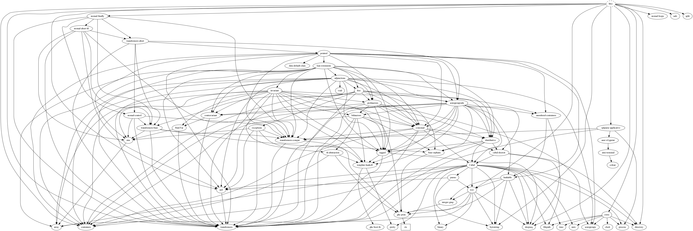

# htcc

A tiny C language compiler (x86-64).

## currently features

- [x] numerical calculation
- [ ] statements
    - [x] return statement
    - [x] `if` statement
    - [x] `else` statement
    - [x] `while` statement
    - [x] `for` statement
    - [ ] `do` statement
    - [ ] `continue` statement
- [x] block scope
- [x] array (multidimensional array)
- [x] function call/definition (up to 6 parameters)
- [ ] types
    - [x] `int`
    - [x] pointer
    - [x] `char`
    - [ ] `float`
- [x] struct (with tag)

and will add more some features...

## Build

```sh
$ stack build
$ stack build --fast # no optimized
```

## Usage

```sh
$ stack exec htcc -- -h
Usage: htcc [--visualize-ast] [--img-resolution RESOLUTION] file [-o|--out file]
            [-w|--supress-warns]

Available options:
  -h,--help                Show this help text
  --visualize-ast          Visualize an AST built from source code
  --img-resolution RESOLUTION
                           Specify the resolution of the AST graph to be
                           generated (default: 640x480)
  file                     Specify the input file name
  -o,--out file            Specify the output destination file name, supported
                           only svg (default: ./out.svg)
  -w,--supress-warns       Disable all warning messages
```

Simple compilation

```sh
$ echo 'int printf(); int main() { printf("hello world!\n"); }' > t.c
$ stack exec htcc -- t.c > t.s
$ gcc -no-pie t.c -o out
```

For one liner...

```sh
$ echo 'int printf(); int main() { printf("hello world!\n"); }' | stack exec htcc -- /dev/stdin | gcc -xassembler -no-pie -o out -  
```

## AST diagram generation

The following command

```sh
$ echo 'int main() { return 1 * 2 + 4; }' | stack exec htcc -- /dev/stdin --visualize-ast
```

is given the following AST graph.


This option allows to specify the resolution and output file

```sh
$ echo 'int printf(); void fizzbuzz(int n) { for (int i = 1; i < n; ++i) { if (!(i % 15)) printf("fizzbuzz\n"); else if (!(i % 5)) printf("fizz\n"); else if (!(i % 3)) printf("buzz\n"); else print    f("%d\n", i); } } int main() { fizzbuzz(50); }' | \
    stack exec htcc -- /dev/stdin --visualize-ast --img-resolution 1280x720 --out fizzbuzz.svg
```

The above command is given the following AST graph.


## Test

```sh
$ stack test --test-arguments help
htcc> test (suite: htcc-test, args: help)

--test-arguments are available by:
        inc     : Test itself with test code written in C (default, more faster).
        subp    : Given C codes as input, run HUnit tests.

htcc> Test suite htcc-test failed
Test suite failure for package htcc-0.0.0.1
    htcc-test:  exited with: ExitFailure 1
Logs printed to console

$ stack test
$ stack test --test-arguments inc
$ stack test --test-arguments subp
```

## Benchmark

```sh
$ stack bench
```

## Dependencies



To generate ([Graphviz](https://www.graphviz.org/) is required),

```sh
$ stack dot --no-include-base --external --prune diagrams-lib,diagrams-svg,diagrams-contrib | dot -Tpng -o out.png
```

## About emoji of commit messages

The emoji included in the commit message is used according to [gitmoji](https://gitmoji.carloscuesta.me/).

## FAQ

### Your compiler is inefficient :)

I know. 
This is a compiler made for research, not for practical purposes.
And the author also developed the compiler for the first time.
If you can suggest improvements, please submit issues or send PRs.
Thanks in advance for all the improvements.

### When I try to play with ghci, I get a warning "WARNING:. is owned by someone else, IGNORING!".

Check your permissions. 
The answer on [stack overflow](https://stackoverflow.com/questions/24665531/ghci-haskell-compiler-error-home-user-ghci-is-owned-by-someone-else-ignor) may be useful.

## References

* [N1570 - JTC1/SC22/WG14](http://open-std.org/jtc1/sc22/wg14/www/docs/n1570.pdf): C11 working draft (PDF)
* [N1570 - JTC1/SC22/WG14](https://port70.net/~nsz/c/c11/n1570.html): C11 working draft (HTML)
