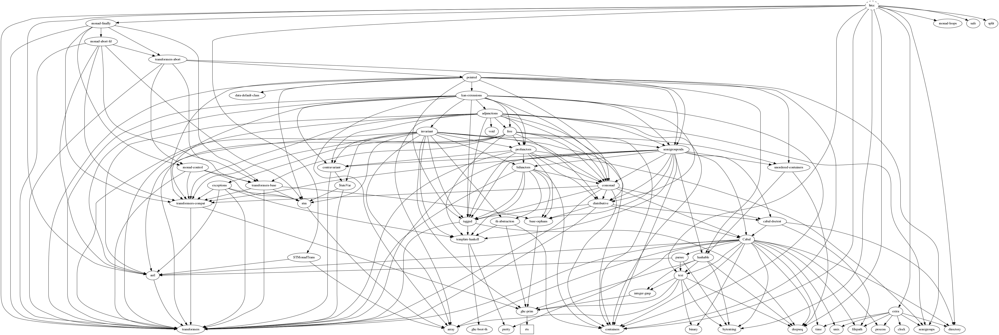

# htcc

A tiny C language compiler (x86-64).

## currently features

- [x] numerical calculation
- [ ] statements
    - [x] return statement
    - [x] `if` statement
    - [x] `else` statement
    - [x] `while` statement
    - [x] `for` statement
    - [ ] `do` statement
    - [ ] `continue` statement
- [x] block scope
- [x] array (multidimensional array)
- [x] function call/definition (up to 6 parameters)
- [ ] types
    - [x] `int`
    - [x] pointer
    - [x] `char`
    - [ ] `float`
- [x] struct (with tag)

and will add more some features...

## Build

```sh
$ stack build
$ stack build --fast # no optimized
```

## Execute

```sh
$ echo 'int main() { printf("hello world!\n"); }' > t.c
$ stack exec htcc -- t.c > t.s
$ gcc -no-pie t.c -o out
```

For one liner...

```sh
$ echo 'int main() { printf("hello world!\n"); }' | stack exec htcc -- /dev/stdin | gcc -xassembler -no-pie -o out -  
```

## Test

```sh
$ stack test --test-arguments help
htcc> test (suite: htcc-test, args: help)

--test-arguments are available by:
        inc     : Test itself with test code written in C (default, more faster).
        subp    : Given C codes as input, run HUnit tests.

htcc> Test suite htcc-test failed
Test suite failure for package htcc-0.0.0.1
    htcc-test:  exited with: ExitFailure 1
Logs printed to console

$ stack test
$ stack test --test-arguments inc
$ stack test --test-arguments subp
```

## Benchmark

```sh
$ stack bench
```

## Dependencies



To generate ([Graphviz](https://www.graphviz.org/) is required),

```sh
$ stack dot --no-include-base --external | dot -Tpng -o out.png
```

## About emoji of commit messages

The emoji included in the commit message is used according to [gitmoji](https://gitmoji.carloscuesta.me/).

## References

* [N1570 - JTC1/SC22/WG14](http://open-std.org/jtc1/sc22/wg14/www/docs/n1570.pdf): C11 working draft (PDF)
* [N1570 - JTC1/SC22/WG14](https://port70.net/~nsz/c/c11/n1570.html): C11 working draft (HTML)
